# Test: Dashboard Source Scan

Register a source root, scan it, inspect progress, drill into thumbnails, browse photos by date, and trigger metadata refresh.

## The initialized store dashboard starts empty.

**Verifications:**
- [x] Photostore heading is visible
- [x] UI build hash is visible
- [x] Source count is zero
- [x] Thumbnail garbage starts at zero
- [x] Recent scans empty state is visible

---

## The asset browser shows an empty state before any content is acquired.

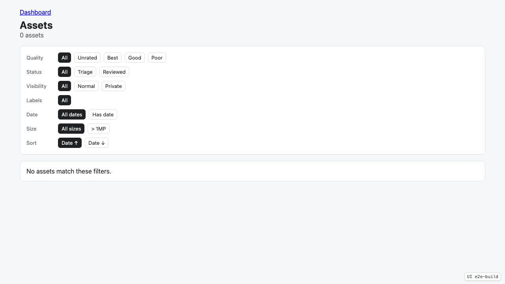

**Verifications:**
- [x] Assets heading is visible
- [x] Asset count is zero
- [x] Assets empty state is visible

---

## The fixture source root is registered and has never been scanned.

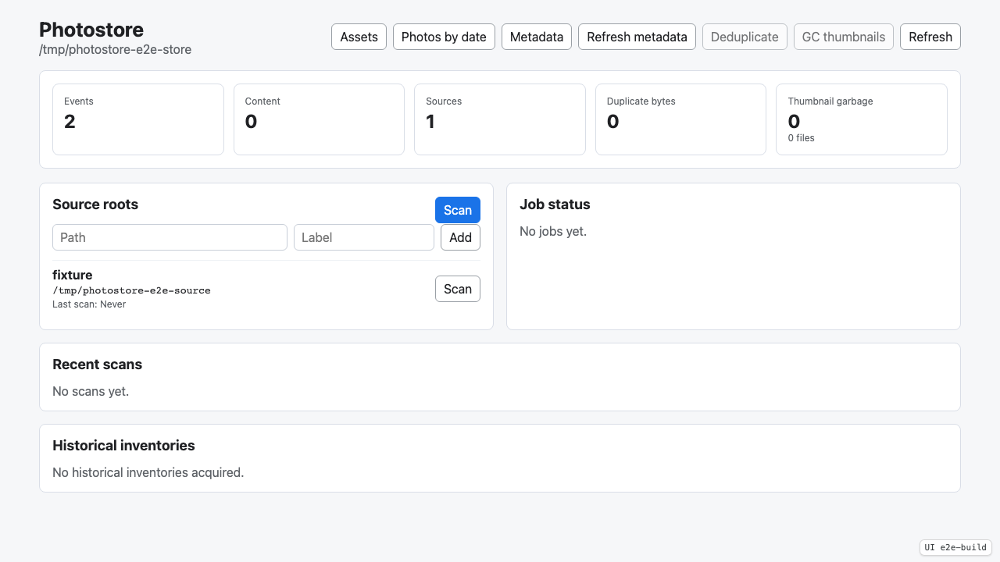

**Verifications:**
- [x] Source count is one
- [x] Fixture source is listed
- [x] Source last scan shows Never

---

## The per-source scan completes with compact progress visible.

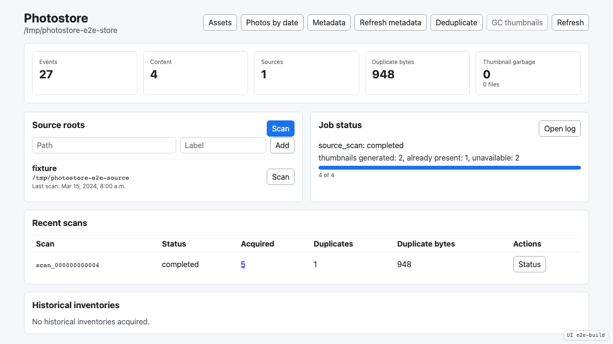

**Verifications:**
- [x] Scan job completed
- [x] Latest progress message is visible
- [x] Latest progress message is capped at 60 visible characters
- [x] Job panel has a stable reserved width
- [x] Full job log is hidden by default
- [x] Source last scan is no longer Never
- [x] Source scan button is re-enabled
- [x] Scan table shows completed scan
- [x] Duplicate bytes summary is updated

---

## Reloading the dashboard restores the latest completed job status and thumbnail summary.

**Verifications:**
- [x] Completed job status is restored
- [x] Thumbnail summary remains available on the compact progress line

---

## The dashboard verifies retained duplicates and releases duplicate bytes.

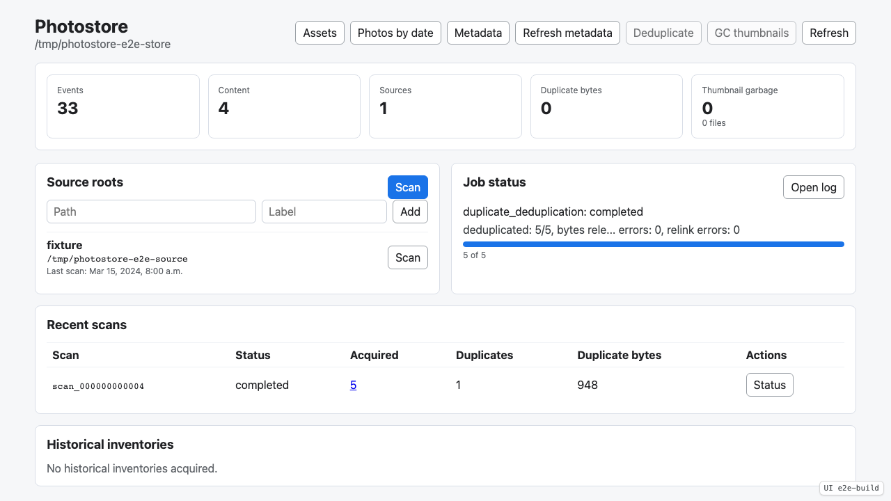

**Verifications:**
- [x] Deduplication job completed
- [x] Deduplication progress reports released bytes
- [x] Job panel width does not change for deduplication progress
- [x] Retained duplicate bytes drop to zero
- [x] Deduplicate button disables when no duplicate bytes remain

---

## A scan row can restore its job status into the status panel.

**Verifications:**
- [x] Selected scan status is visible
- [x] Selected scan thumbnail summary is visible

---

## The dashboard reports stale thumbnail renderer output and removes it through explicit garbage collection.

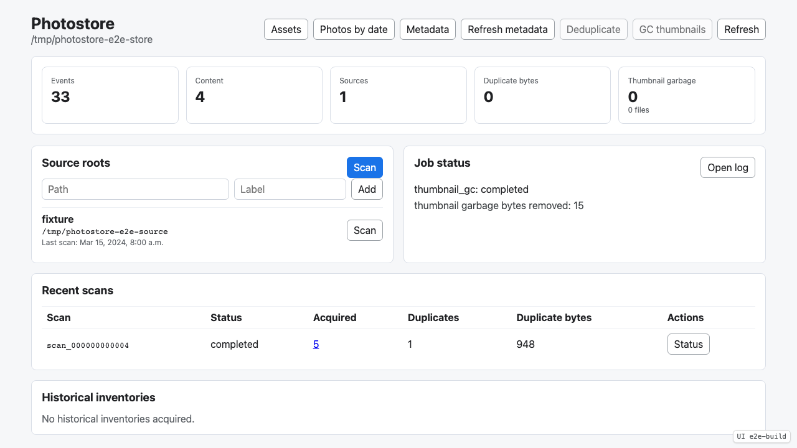

**Verifications:**
- [x] Thumbnail garbage collection job completed
- [x] Thumbnail garbage progress reports removed bytes
- [x] Thumbnail garbage byte counter drops to zero
- [x] Thumbnail garbage button disables after collection

---

## Opening the job log reveals the scrollable acquisition log.

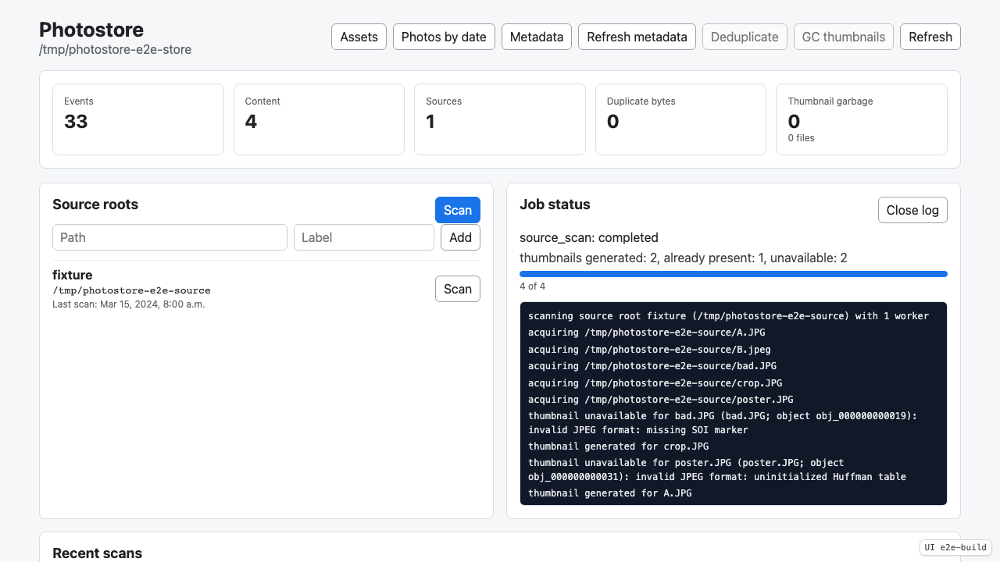

**Verifications:**
- [x] Job log contains acquisition messages
- [x] Open log button changed to Close log

---

## The acquired count opens a thumbnail grid with image links.

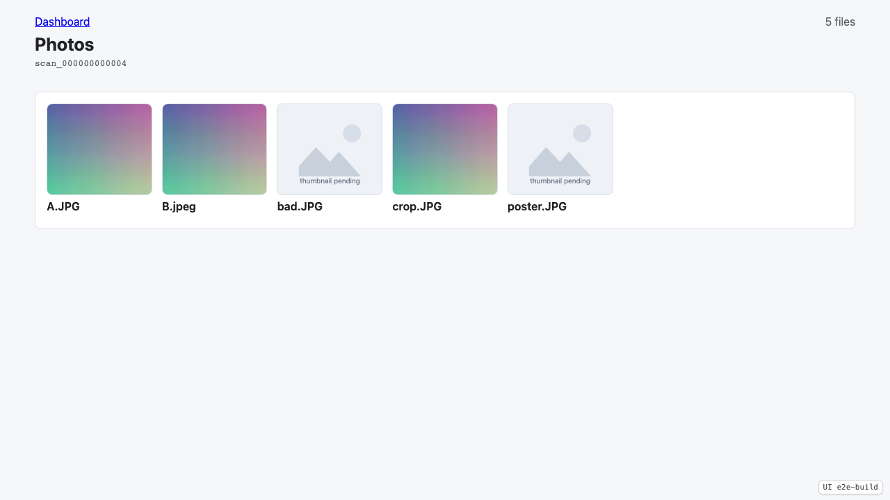

**Verifications:**
- [x] Photos heading is visible
- [x] Photo grid lists A.JPG by filename
- [x] Photo grid does not show the absolute source path
- [x] Generated thumbnails are visible
- [x] First acquired file opens the image view with scan context
- [x] First thumbnail serves image/jpeg

---

## The image view shows the original image and a readable information side panel.

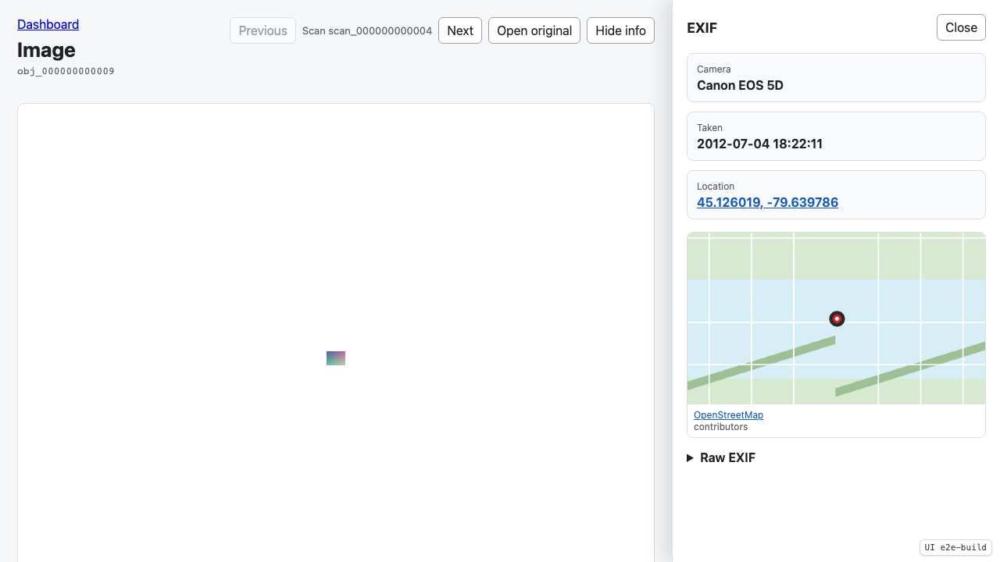

**Verifications:**
- [x] Image view renders the photo
- [x] Scan navigation context is visible
- [x] Previous is disabled for the first scan photo
- [x] Next photo button is available
- [x] Open original serves image/jpeg
- [x] EXIF panel is visible
- [x] Camera summary is visible
- [x] Capture date summary is visible
- [x] Location summary is visible
- [x] Local map fragment is visible
- [x] Raw EXIF debug section is available

---

## The image view can advance to the next photo in the scan order and preserve navigation context.

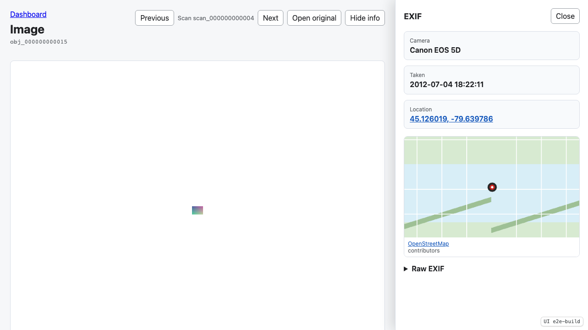

**Verifications:**
- [x] The URL changes to another object
- [x] The scan context remains in the URL
- [x] The image remains visible after navigation
- [x] Previous button points back into the same scan
- [x] Navigation context remains visible

---

## The date browser lists years derived from raw EXIF metadata.

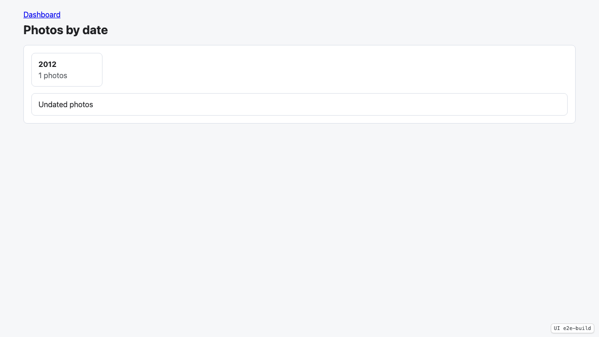

**Verifications:**
- [x] Photos by date heading is visible
- [x] Capture year 2012 is listed
- [x] Duplicate content is counted once in the year bucket

---

## Selecting a year lists capture months.

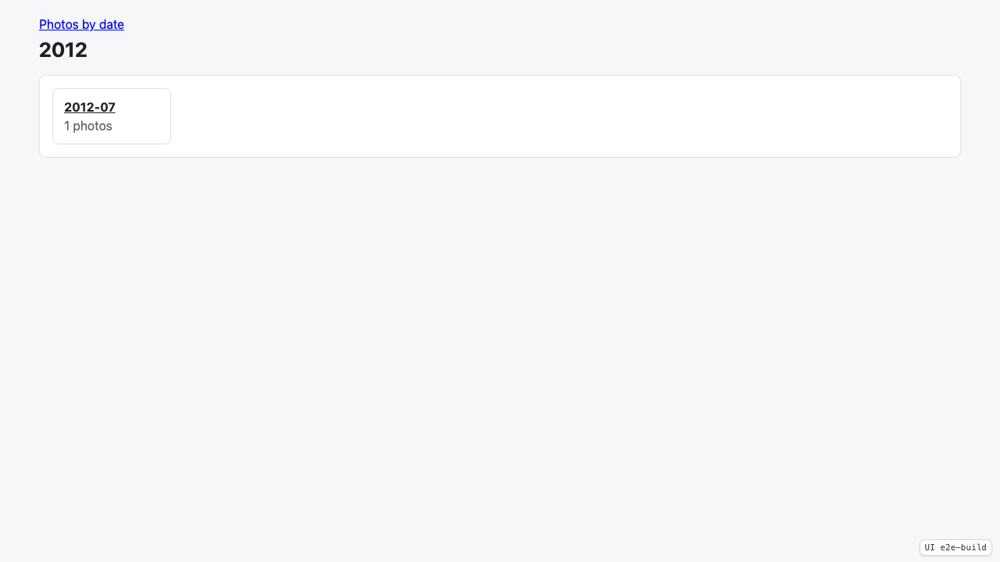

**Verifications:**
- [x] Selected year heading is visible
- [x] Capture month 2012-07 is listed

---

## Selecting a month lists capture days.

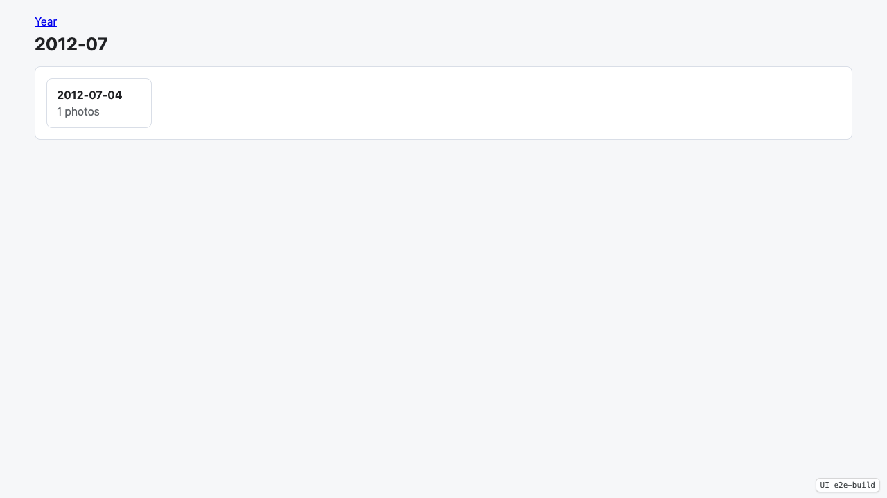

**Verifications:**
- [x] Selected month heading is visible
- [x] Capture day 2012-07-04 is listed

---

## Selecting a capture day opens a thumbnail grid for that date.

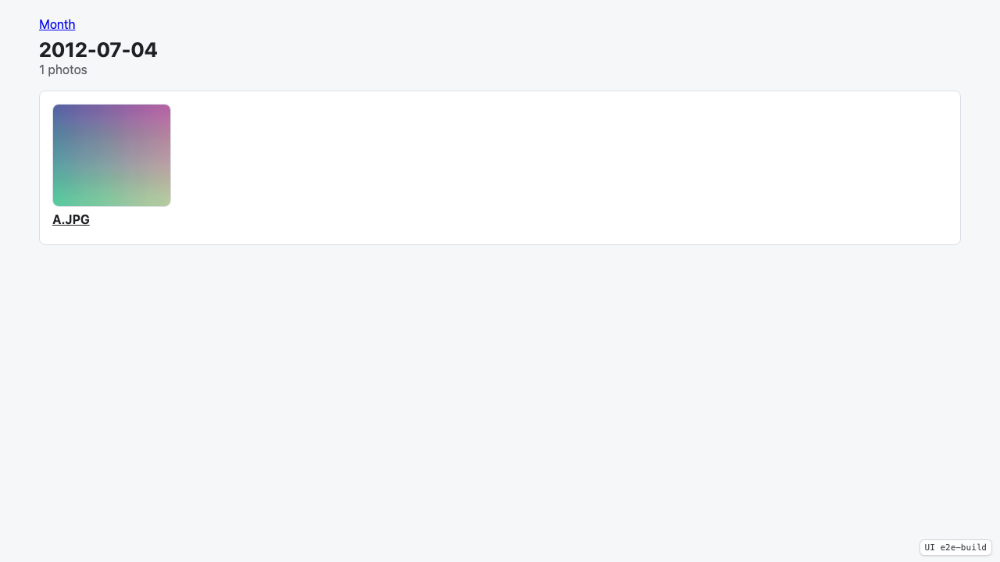

**Verifications:**
- [x] Selected capture day heading is visible
- [x] Date photo grid lists the representative filename
- [x] Date photo grid does not show duplicate content twice
- [x] Date thumbnail is visible

---

## The metadata review page shows extraction results and photos where no metadata was found.

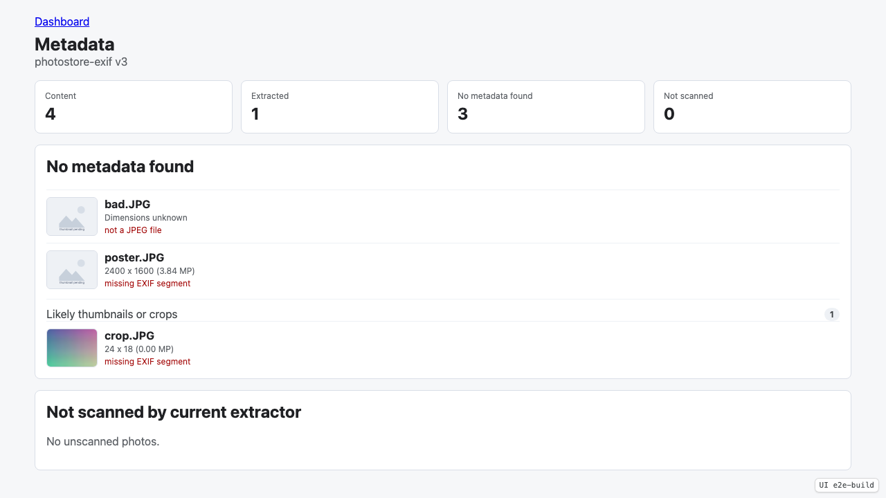

**Verifications:**
- [x] Metadata heading is visible
- [x] One unique content item has extracted metadata
- [x] Three photos have no metadata found
- [x] No current extractor work remains unscanned
- [x] Failed metadata list identifies bad.JPG
- [x] Main metadata failure list keeps the large no-EXIF photo visible
- [x] Main metadata failure list hides the small crop by default
- [x] Small metadata failures are collapsed with a count
- [x] Failed metadata list shows the extraction error
- [x] Opening likely thumbnails or crops reveals crop.JPG
- [x] Unscanned metadata empty state is visible

---

## The dashboard can trigger a metadata refresh for photos without recorded metadata results.

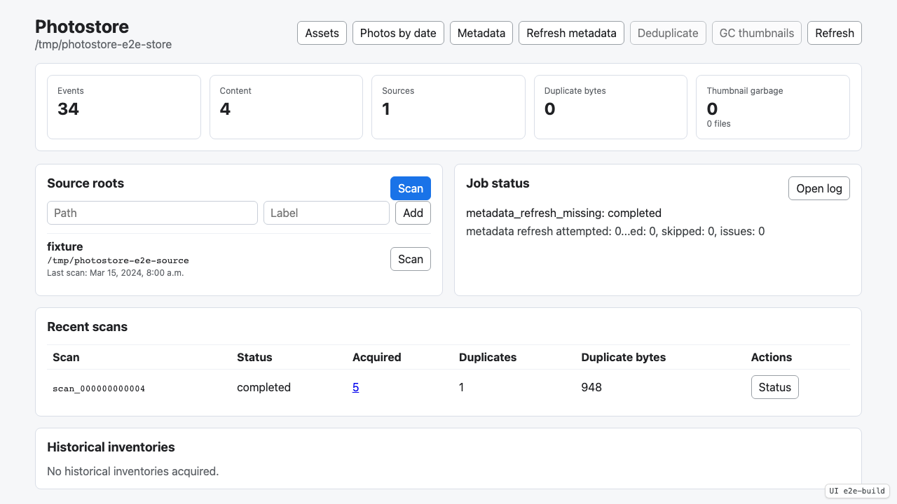

**Verifications:**
- [x] Metadata refresh job completed
- [x] Metadata refresh reports no missing work after scan-time extraction

---

