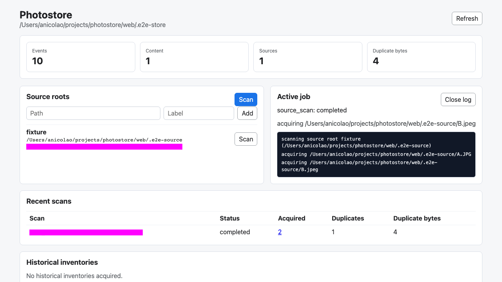
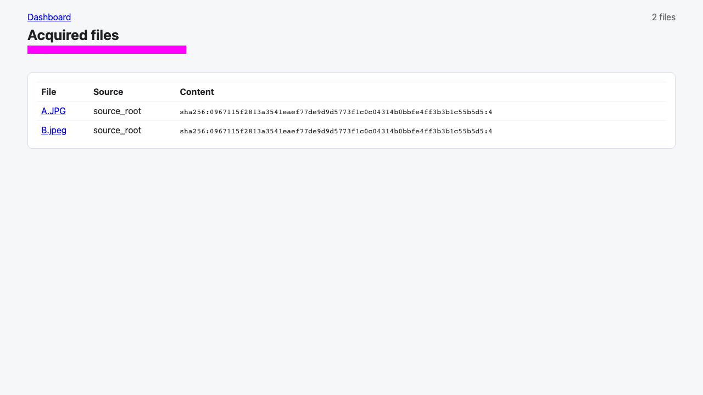

# Test: Dashboard Source Scan

Register a source root, scan it, inspect the compact progress log, and drill into acquired files.

## The initialized store dashboard starts empty.

**Verifications:**
- [x] Photostore heading is visible
- [x] Source count is zero
- [x] Recent scans empty state is visible

---

## The fixture source root is registered and has never been scanned.

**Verifications:**
- [x] Source count is one
- [x] Fixture source is listed
- [x] Source last scan shows Never

---

## The per-source scan completes with compact progress visible.

**Verifications:**
- [x] Scan job completed
- [x] Latest progress message is visible
- [x] Full job log is hidden by default
- [x] Source last scan is no longer Never
- [x] Scan table shows completed scan
- [x] Duplicate bytes summary is updated

---

## Opening the job log reveals the scrollable acquisition log.

**Verifications:**
- [x] Job log contains acquisition messages
- [x] Open log button changed to Close log

---

## The acquired count opens a file list with image links.

**Verifications:**
- [x] Acquired files heading is visible
- [x] Acquired table lists A.JPG
- [x] First acquired file link serves image/jpeg

---

