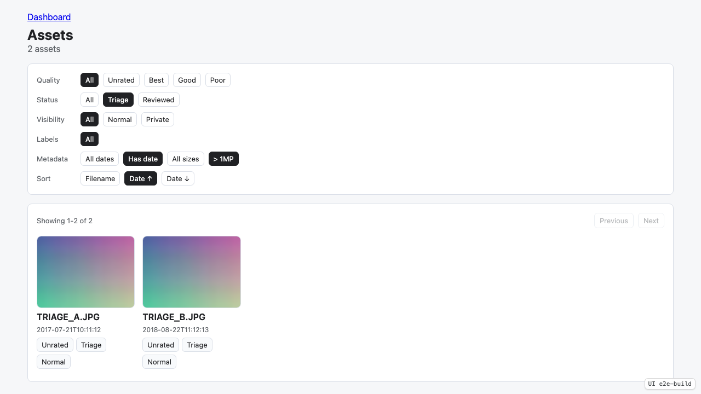
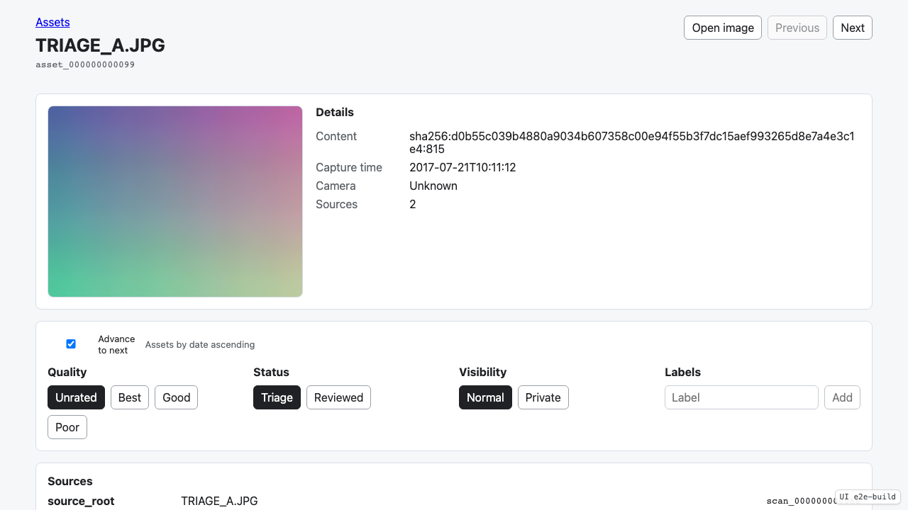
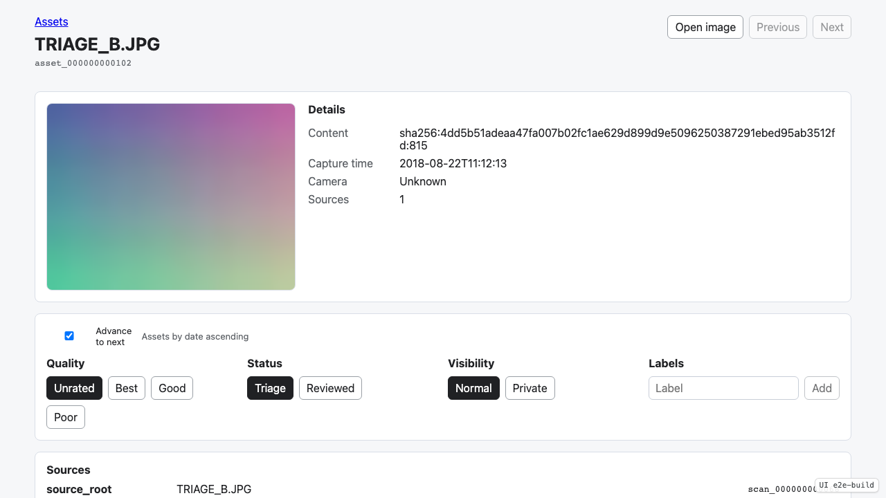
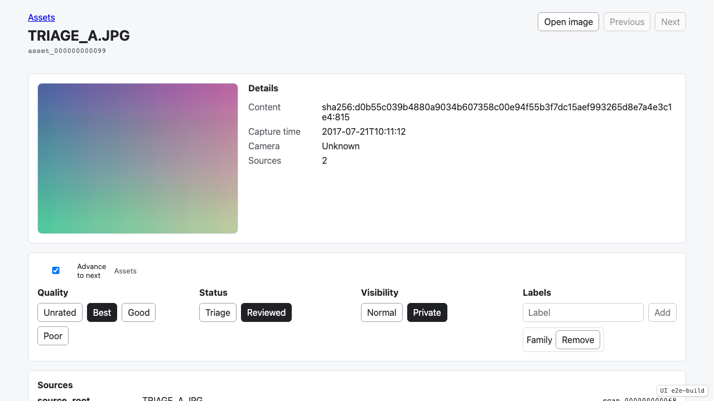
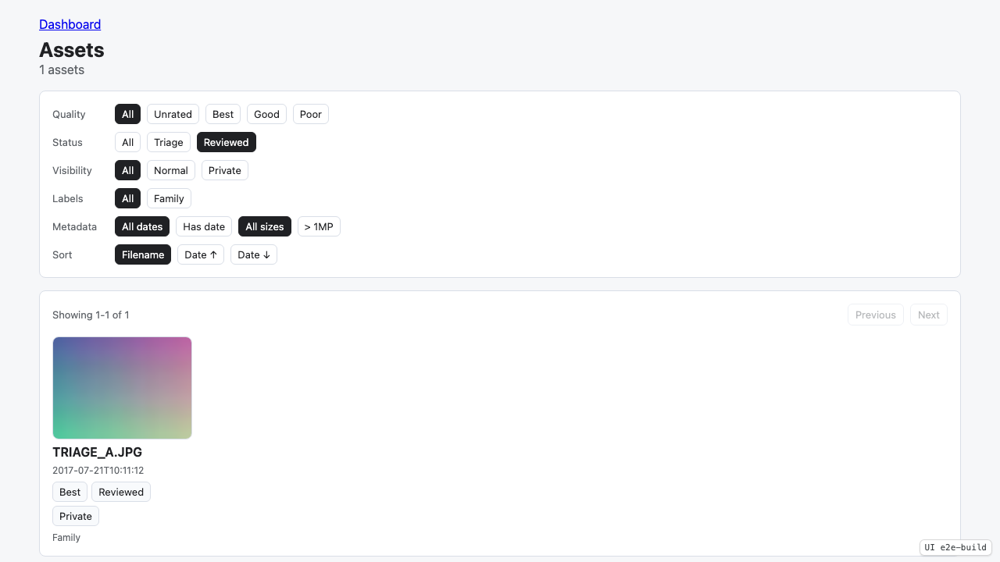
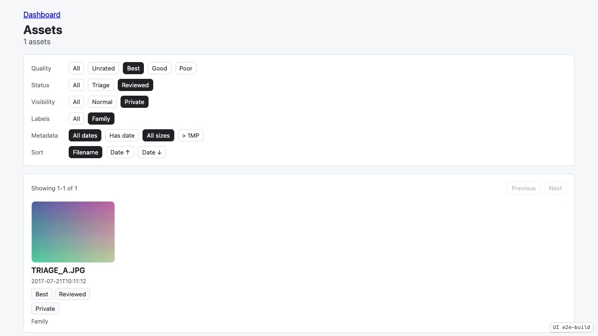
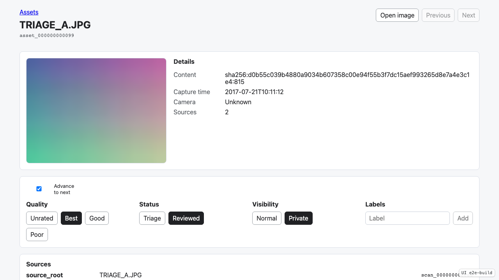

# Test: Asset Triage

Scan duplicate JPEG content, filter the triage queue, navigate asset decisions, set labels, and verify reviewed assets.

## The triage fixture source is scanned and assets are available from the dashboard.

**Verifications:**
- [x] Scan job completed
- [x] Assets entry point is visible

---

## The asset grid shows duplicated JPEG content as one asset with default triage state.

**Verifications:**
- [x] Assets heading is visible
- [x] Duplicate fixture content appears as one asset card
- [x] Asset pager reports the current page range
- [x] Default quality is Unrated
- [x] Default status is Triage
- [x] Default visibility is Normal

---

## The triage queue can be filtered to dated photos above one megapixel and sorted by capture date.

**Verifications:**
- [x] Triage status filter is active
- [x] Known date filter is active
- [x] Large image filter is active
- [x] Date ascending sort is active
- [x] Large dated triage item A is visible
- [x] Large dated triage item B is visible
- [x] Small dated item is excluded
- [x] No-date item is excluded

---

## The asset detail view shows triage controls, navigation, and both source occurrences.

**Verifications:**
- [x] Asset detail thumbnail is visible
- [x] Asset source count is two
- [x] Source provenance lists original fixture path
- [x] Source provenance lists duplicate fixture path
- [x] Advance to next is checked by default
- [x] Next asset navigation is available

---

## Setting quality marks the asset reviewed in the reducer and advances to the next triage item.

**Verifications:**
- [x] The detail view advanced to TRIAGE_B.JPG
- [x] The reviewed asset left the Triage navigation queue
- [x] The next asset remains in Triage

---

## The asset detail view records quality, status, visibility, and a user-defined label.

**Verifications:**
- [x] Best quality is selected
- [x] Reviewed status is selected
- [x] Private visibility is selected
- [x] Family label is visible

---

## A direct status query URL filters the asset grid and preserves the active filter state.

**Verifications:**
- [x] Reviewed status filter is active
- [x] Status-filtered grid contains the reviewed asset
- [x] Status-filtered pager shows one displayed asset

---

## The asset grid filters by quality, status, visibility, and user-defined label.

**Verifications:**
- [x] Best filter is active
- [x] Reviewed filter is active
- [x] Private filter is active
- [x] Filtered grid still contains the triaged asset

---

## A user-defined label can be removed from the asset.

**Verifications:**
- [x] Family label is no longer visible

---

