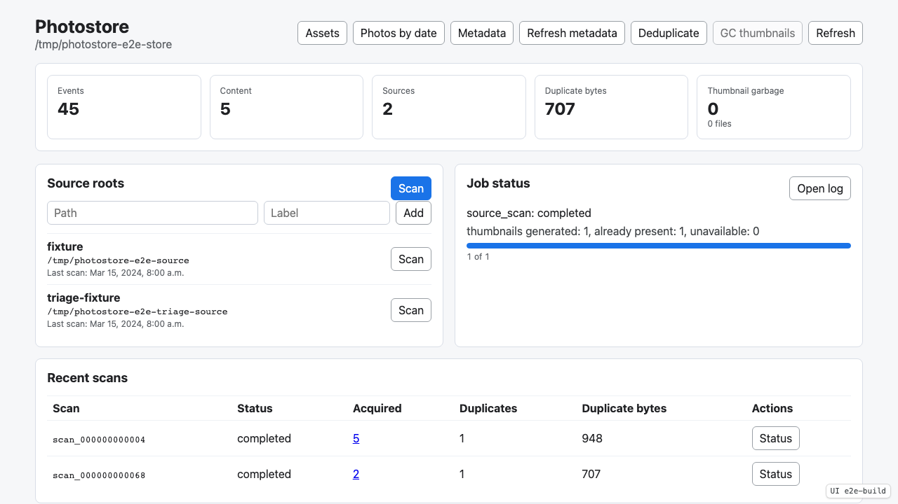
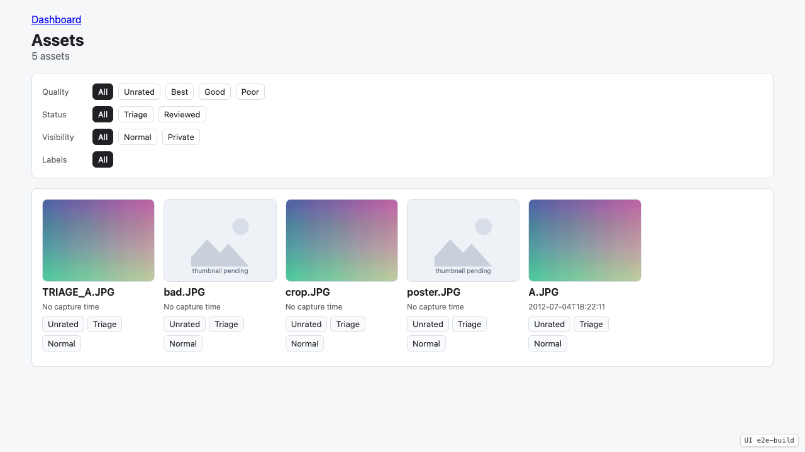
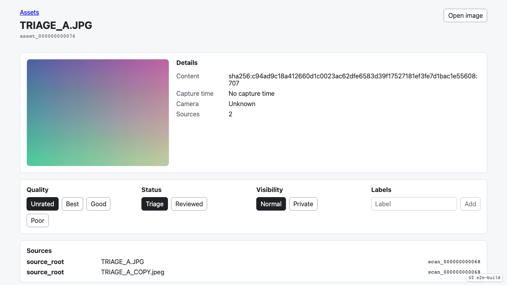
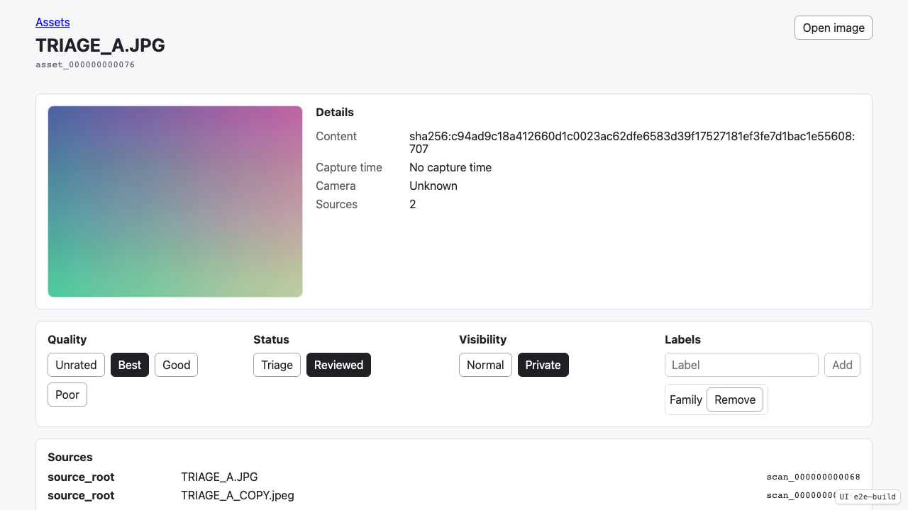
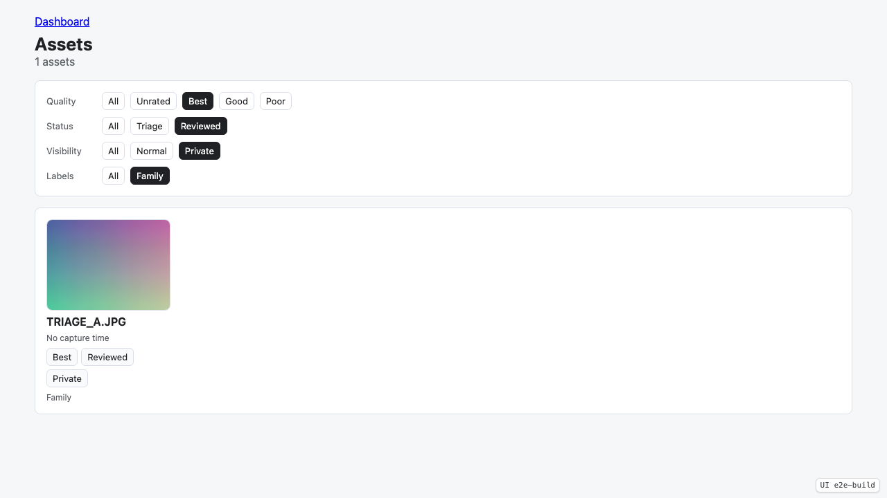
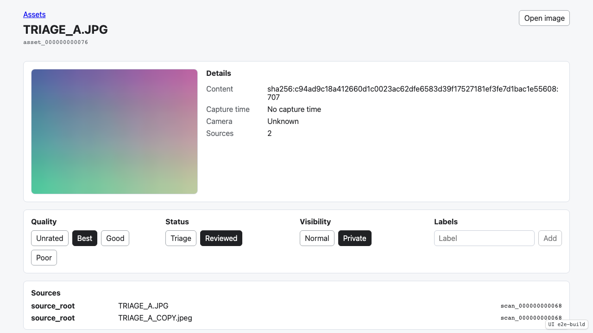

# Test: Asset Triage

Scan duplicate JPEG content, open the asset view, set quality/status/visibility, manage labels, and filter the asset grid.

## The triage fixture source is scanned and assets are available from the dashboard.

**Verifications:**
- [x] Scan job completed
- [x] Assets entry point is visible

---

## The asset grid shows one asset for duplicated JPEG content with default triage state.

**Verifications:**
- [x] Assets heading is visible
- [x] Duplicate fixture content appears as one asset card
- [x] Default quality is Unrated
- [x] Default status is Triage
- [x] Default visibility is Normal

---

## The asset detail view shows triage controls and both source occurrences.

**Verifications:**
- [x] Asset detail thumbnail is visible
- [x] Asset source count is two
- [x] Source provenance lists original fixture path
- [x] Source provenance lists duplicate fixture path

---

## The asset detail view records quality, status, visibility, and a user-defined label.

**Verifications:**
- [x] Best quality is selected
- [x] Reviewed status is selected
- [x] Private visibility is selected
- [x] Family label is visible

---

## The asset grid filters by quality, status, visibility, and user-defined label.

**Verifications:**
- [x] Best filter is active
- [x] Reviewed filter is active
- [x] Private filter is active
- [x] Filtered grid still contains the triaged asset

---

## A user-defined label can be removed from the asset.

**Verifications:**
- [x] Family label is no longer visible

---

